## WEB STACK IMPLEMENTATION (LAMP STACK) IN AWS

### Connecting to EC2 terminal

This code was used to change permission of the .pem file for user
`chmod 0400 EC2-PBL.pem`

Below code was used to connect to the EC2 instance

`ssh -i EC2-PBL.pem ubuntu@3.8.20.94`

Result of connecting to EC2 instance is shown below

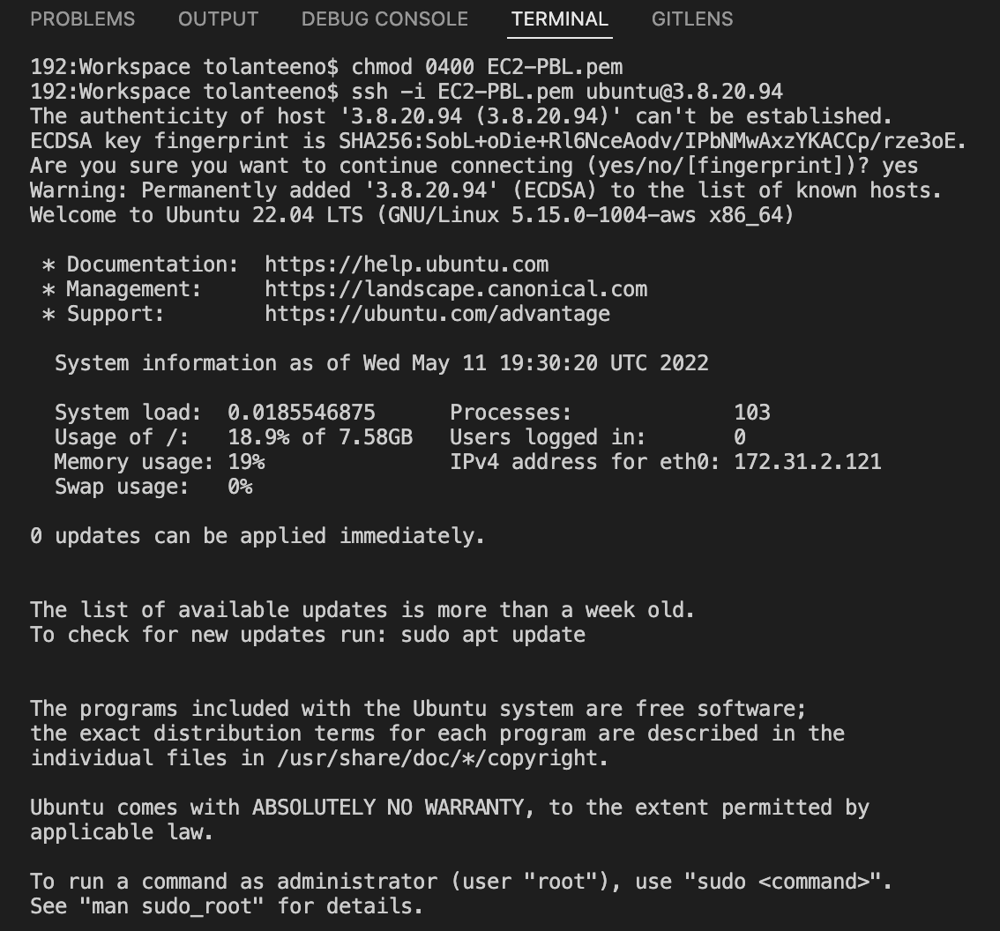

Below is a diagram depicting the server connection architecture
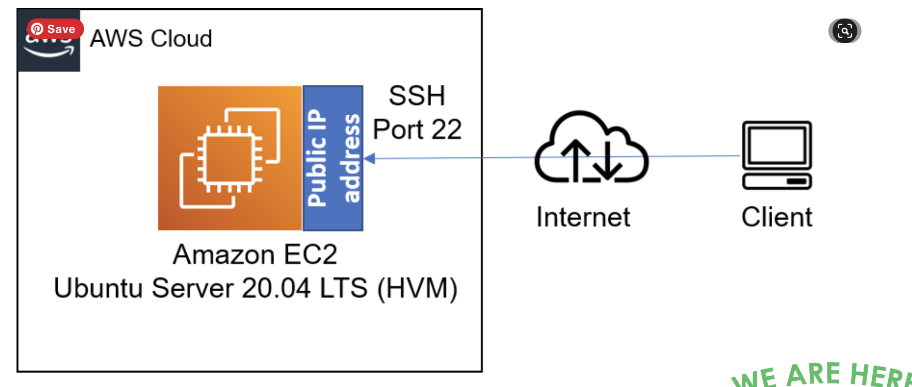

### STEP 1 — INSTALLING APACHE AND UPDATING THE FIREWALL

`sudo apt update`

Result
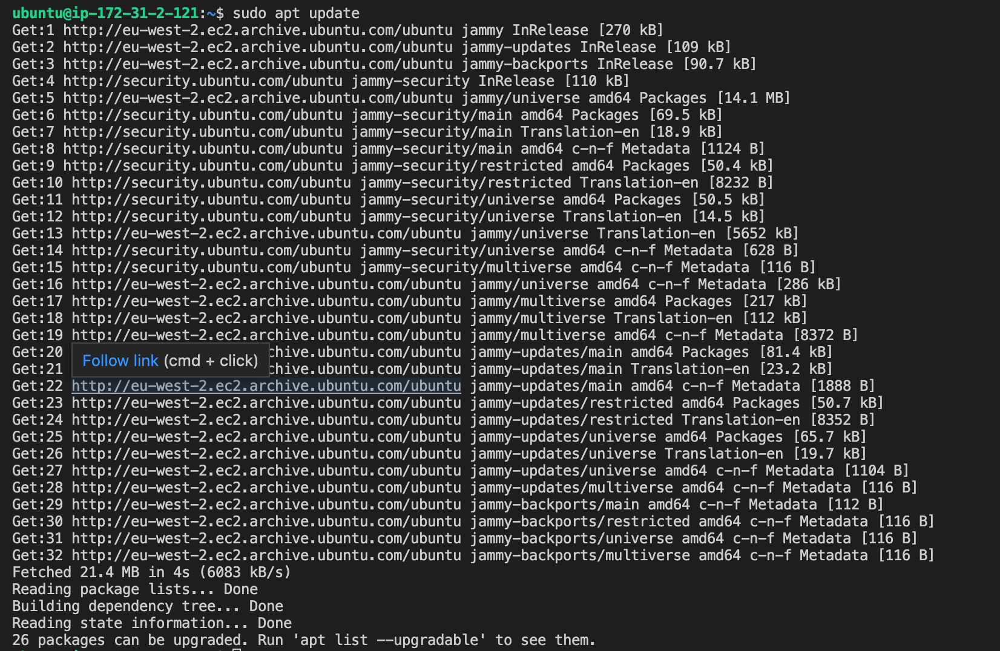

`sudo apt install apache2`

Result
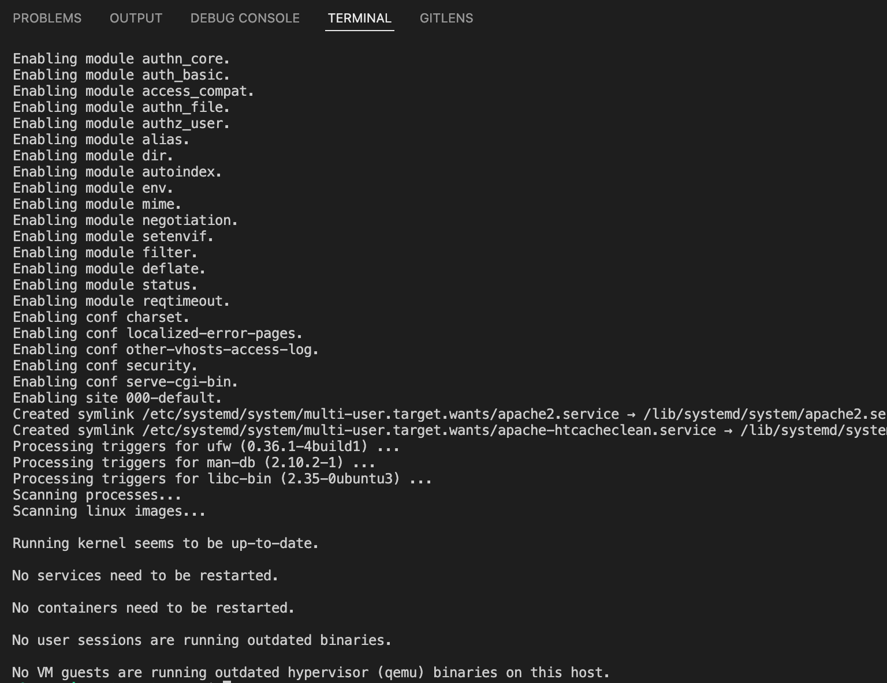

`sudo systemctl status apache2`

Result to verify Apache is runnig on the server
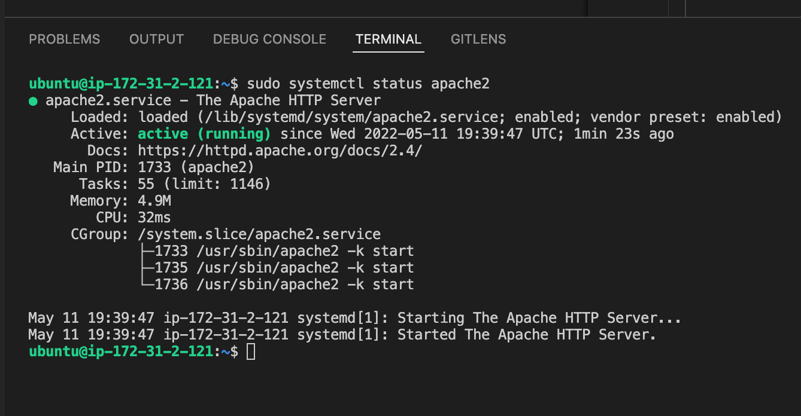

Edit inbound rules in security group to change TCP to port 80

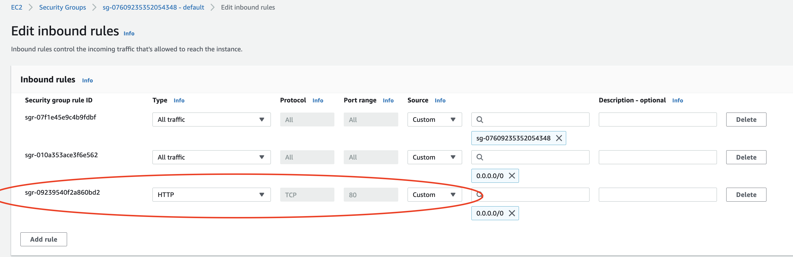

To access port 80 locally in our Ubuntu shell, run the following:

` curl http://localhost:80`

Test how the Apache HTTP server will respond to requests from the internet by running the following in an open browser

`http://<Public-IP-Address>:80` 
when replacing the ip address of the EC2 instance, the command is `http://3.8.20.94:80`

The result is shown below:

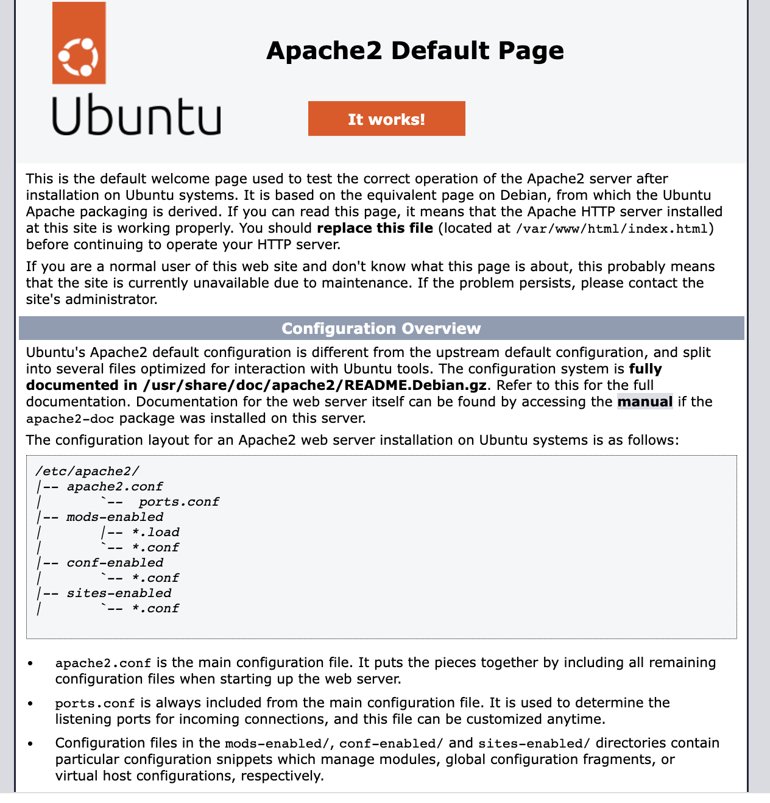

Alternative way of doing above via the terminal is running the code below:
`curl -s http://169.254.169.254/latest/meta-data/3.8.20.94:80`

Result is as follows represented in html format: 
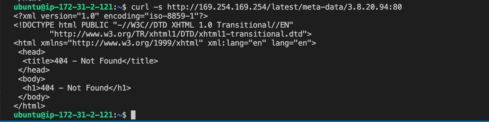

### STEP 2 — INSTALLING MYSQL

Code to acquire and install the software

`sudo apt install mysql-server`

result

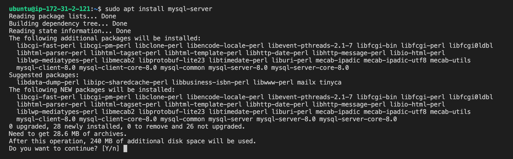

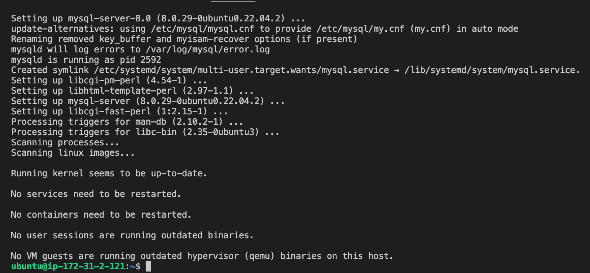

`sudo mysql_secure_installation`

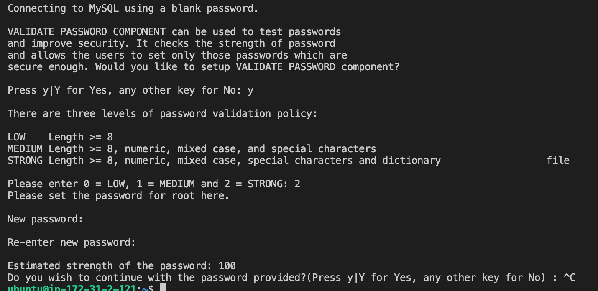

Test to ensure one can log into mysql by running below code:

`sudo mysql`

Result

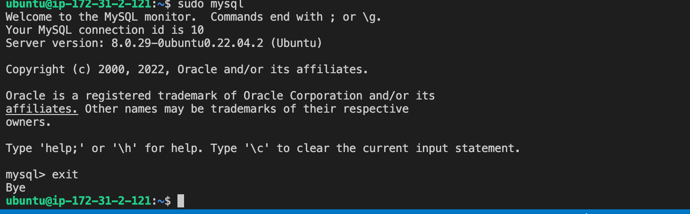

### STEP 3 — INSTALLING PHP

Use code below to install 3 packages at once

`sudo apt install php libapache2-mod-php php-mysql`

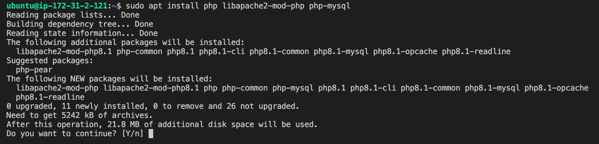

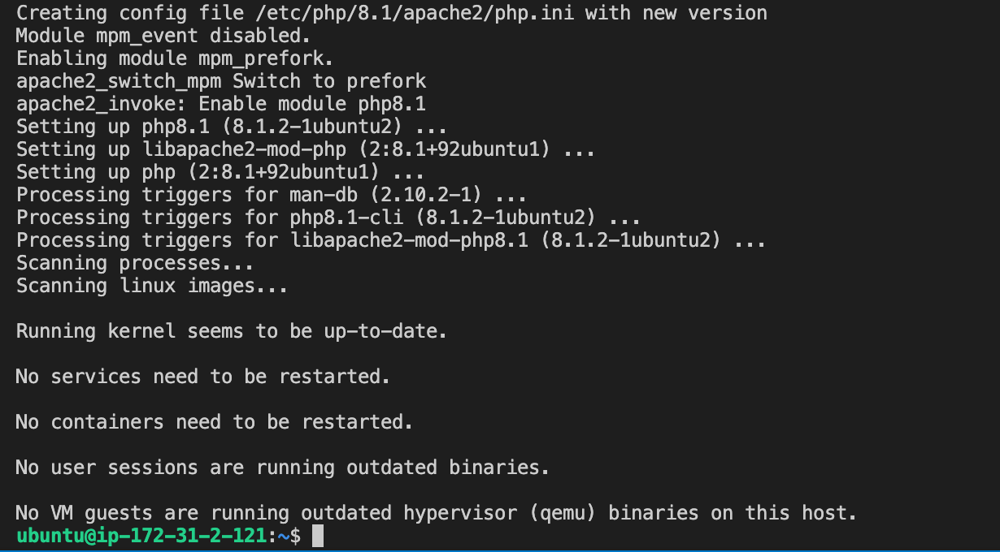

Check Php version after installation by running the code:

`php -v`

Result

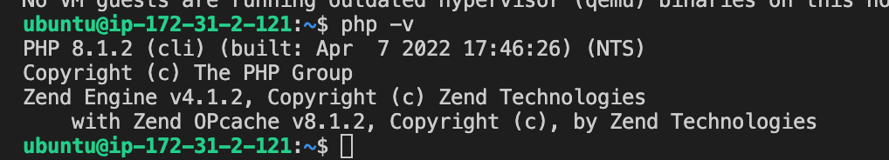

Next step is to set up a proper Apache Virtual Host to hold the websites files and folders. Sample of what a virtual host looks like is as follows:

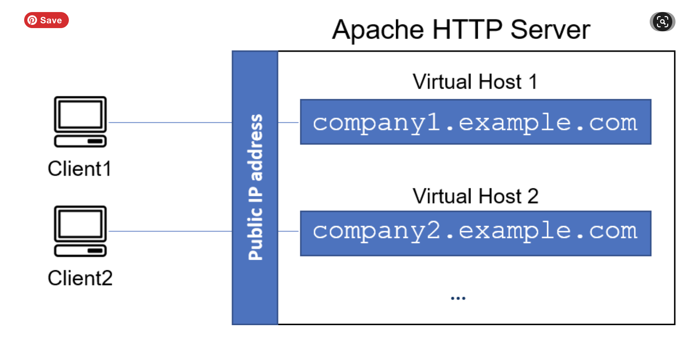

### STEP 4 — CREATING A VIRTUAL HOST FOR YOUR WEBSITE USING APACHE

In this project, I will set up a domain called projectlamp but this can be replaced with a domain of my choice later. 

Create the directory for projectlamp using ‘mkdir’ command as follows:

`sudo mkdir /var/www/projectlamp`

Next, assign ownership of the directory with my current system user:

`sudo chown -R $USER:$USER /var/www/projectlamp`

Continue with the following code:

`sudo vi /etc/apache2/sites-available/projectlamp.conf`

then paste the given configuration file and save.

Use command below tp show the new file called sites available:

`sudo ls /etc/apache2/sites-available`

result

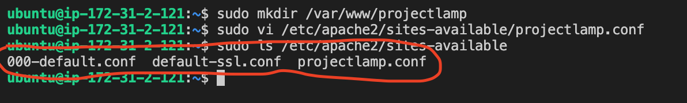

Use command below to enable the new virtual host:

`sudo a2ensite projectlamp`

Result:

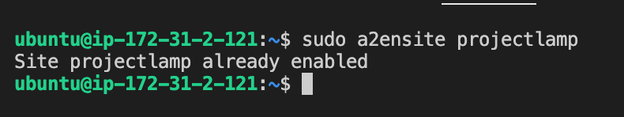

Check Configuration file doesn't contain errors using code below:
`sudo apache2ctl configtest`

Reload Apache using code below:
`sudo systemctl reload apache2`

The new website is now active, but the web root /var/www/projectlamp is still empty. To create an index.html file in that location so that we can test that the virtual host works as expected (note to use ip address of EC2 instance):

`sudo echo 'Hello LAMP from hostname' $(curl -s http://169.254.169.254/latest/meta-data/public-hostname) 'with public IP' $(curl -s http://169.254.169.254/latest/meta-data/public-ipv4) > /var/www/projectlamp/index.html`

Now enter the following into your web browser (note to replace ipv4 with address of your ec2 instance)

`http://<Public-IP-Address>:80`

This results in the contents of the file that was pasted above showing on my website. See snapshot below:

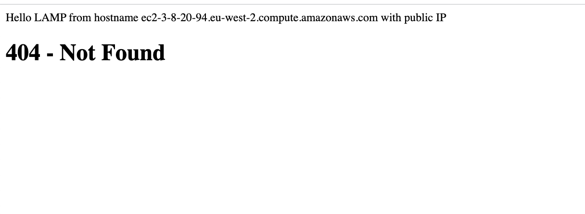

### STEP 5 — ENABLE PHP ON THE WEBSITE

Here an index.php file will be created to show on our website. I will edit the /etc/apache2/mods-enabled/dir.conf file and change the order in which the index.php file is listed within the DirectoryIndex directive:

`sudo vim /etc/apache2/mods-enabled/dir.conf`

Replace the content of the resulting file with the following:

`<IfModule mod_dir.c>
        #Change this:
        #DirectoryIndex index.html index.cgi index.pl index.php index.xhtml index.htm
        #To this:
        DirectoryIndex index.php index.html index.cgi index.pl index.xhtml index.htm
</IfModule>`

Then run the following code:

`sudo systemctl reload apache2`

Finally,I will create a file named index.php inside the custom web root folder using below code:
`vim /var/www/projectlamp/index.php`

The following will be added into the blank file that opens

`<?php
phpinfo();`

Upon refershing the page, the following is the result:

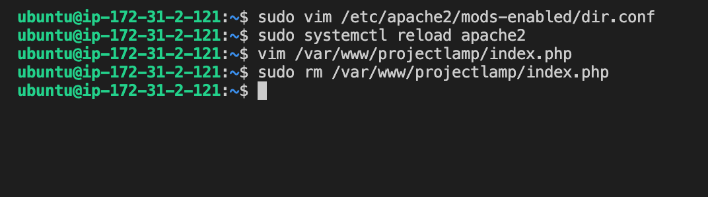

This page provides information about your server from the perspective of PHP. It is useful for debugging and to ensure that your settings are being applied correctly

As above is sensitive information, it can be removed and created again if necessary. use code below to remove:

`sudo rm /var/www/projectlamp/index.php`

